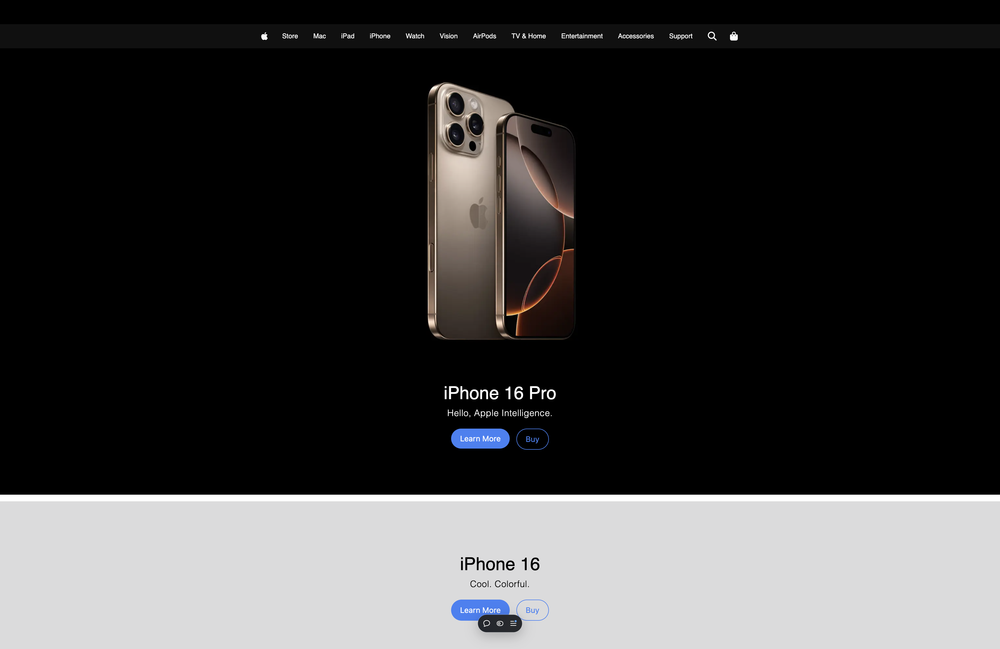
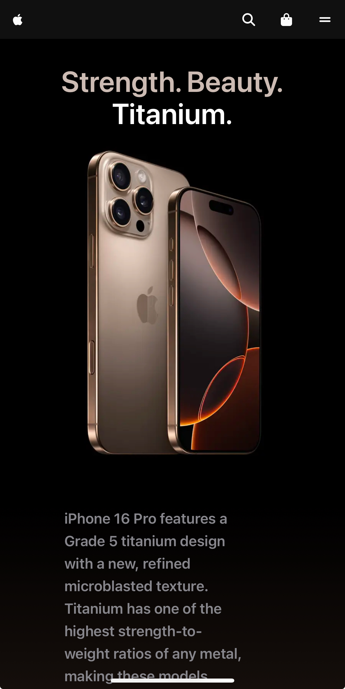

# fApple 🍎 (in progress)

fApple is a clone of the official Apple website, built to emulate its design and functionality. 
This project is an exercise in building a responsive, elegant, and modern web application.

## Features
- Responsive Design: Optimized for desktop, ,tablet, and mobile devices.
- Dynamic Product Pages: Simulating Apple’s product categories
- Modular Components: Component-based structure for easy re-usability and maintainability.
[//]: # (- Search and Cart Functionality: Search bar and a simple cart to simulate e-commerce functionality.)

## Technologies
- Frontend: HTML / CSS / JavaScript
- JS: Next.JS
- CSS: Tailwind CSS
- Icons: fontAwesome
- Animations: animate.css

## Usage
- Home Page: Displays Apple’s signature products and promotions.
- Product Page: Provides detailed views of product (iPhone16 Pro).
- Navigation: Explore various Apple categories. (currently only iPhone16 Pro).

## Demo 
- View the live demo of fApple here -> [fApple](https://f-apple.vercel.app)

